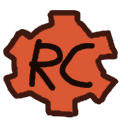
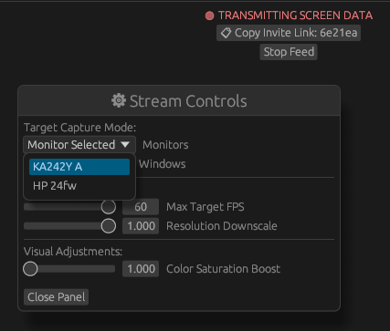
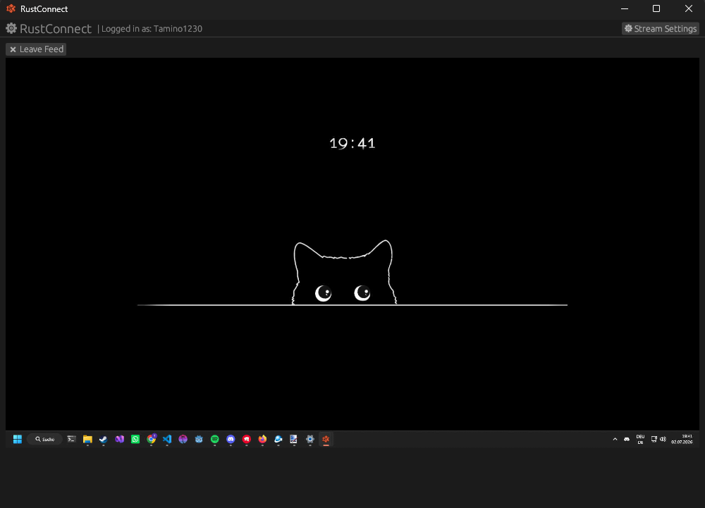

<p align="center"></p>

<h1 align="center">RustConnect</h1>

<p align="center">
  A written in Rust Open-Source Smooth 60fps Screensharing App with a interactive Pipe: rustconnect://CODE. Official webservice API isnt implemented yet!
</p>

<hr>

<p align="center">
    <a target="_blank" href="https://github.com/Tamino1230/RustConnect/releases/download/v0.1.0/RustConnectInstaller.exe">
        
    </a>
</p>

<p align="center">
    
    
    


<p align="center">
    
    
</p>

> [!CAUTION]
> This product can **CURRENTLY** only be used with a local server.

## Installation
Go to the [Latest Release](https://github.com/Tamino1230/RustConnect/releases/latest) and download the `RustConnectionInstaller.exe` and run it!

## Making Dev Build
If you wanna edit code and make a dev build run:
```sh
git clone https://github.com/Tamino1230/RustConnect.git
cd RustConnect/src/build/
.\build.bat
```
then the **RustConnect.exe** will appear in the build folder.